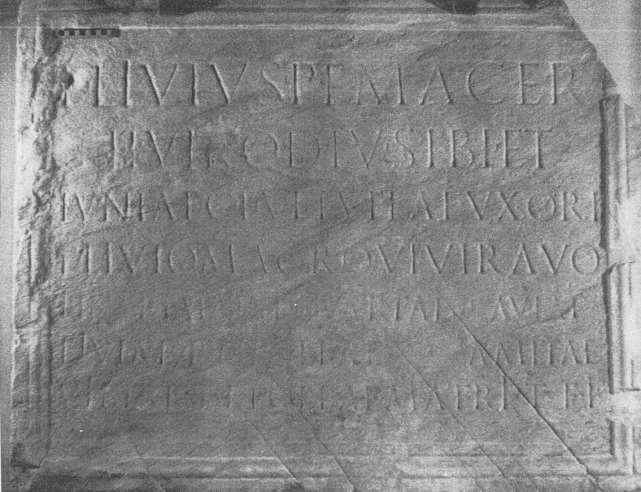
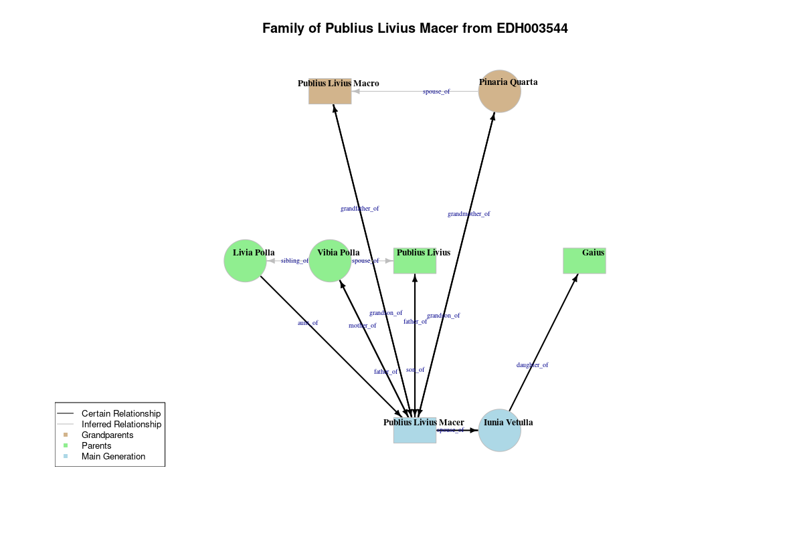
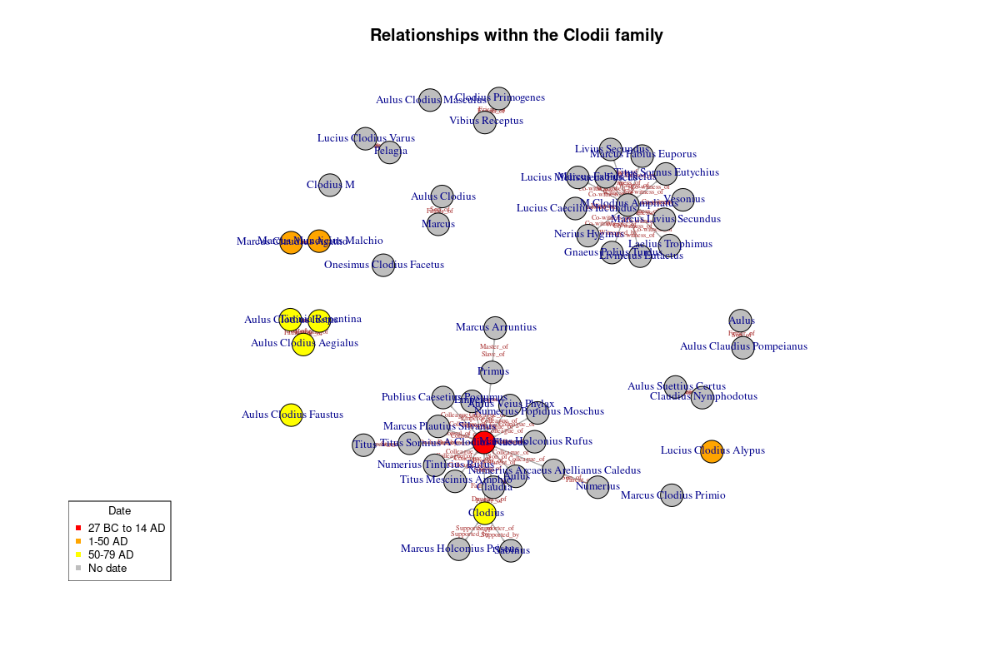
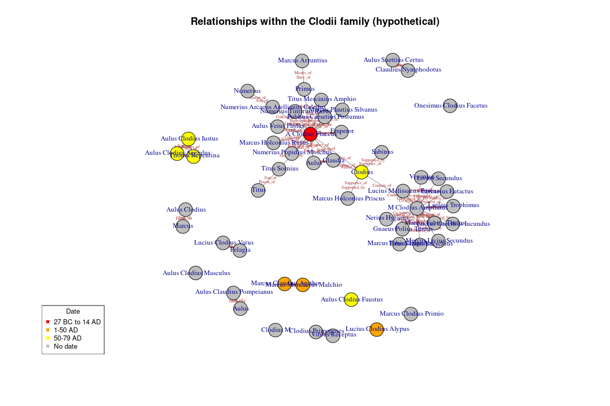

_Event: Epigraphy.info IX, 2-4 April 2025, Aarhus, Denmark. See https://epigraphy.info/workshop_9/ for details._

This script demonstrates how to convert people and their relationships from Latin inscriptions into a network representation.

# Initial setup

```{r setup, echo=TRUE, message=FALSE, warning = FALSE}

# Install required packages if not already installed
if (!requireNamespace("igraph", quietly = TRUE)) install.packages("igraph")
if (!requireNamespace("dplyr", quietly = TRUE)) install.packages("dplyr")
if (!requireNamespace("ggplot2", quietly = TRUE)) install.packages("ggplot2")
if (!requireNamespace("ggraph", quietly = TRUE)) install.packages("ggraph")
if (!requireNamespace("networkD3", quietly = TRUE)) install.packages("networkD3")
if (!requireNamespace("tidyverse", quietly = TRUE)) install.packages("tidyverse")

# Load required libraries
library(igraph)      # For network creation and analysis
library(dplyr)       # For data manipulation
library(ggplot2)     # For visualization
library(ggraph)      # For advanced network visualization
library(networkD3)   # For interactive visualization
library(tidyverse)   # For data manipulation

```

# Case study 1 - family network of Publis Livius Macer

## The inscription and its context

We are going to be working with a real inscription:
**Epitaph from S. Ponso Canavese (Transpadana (Regio XI))** from EDH (https://edh.ub.uni-heidelberg.de/edh/inschrift/HD003544)

---

**Chronological Data**:

- 51 AD – 150 AD (EDH)
- 71 AD - 130 AD (EDR)
- 75 AD - 125 AD (Trismegistos)
- 71 AD - 130 AD (EDCS)

**Transcription** (from EDH):

_P(ublius) Livius P(ubli) f(ilius) Macer  <br>
IIvir QDIV sibi et  <br>
Iuniae C(ai) f(iliae) Vetullae uxori <br>
P(ublio) Livio Macro VIvir(o) avo  <br>
Pinariae Sex(ti) f(iliae) Quartae aviae  <br>
Liviae P(ubli) f(iliae) Pollae amitae  <br>
Vibiae T(iti) f(iliae) Pollae matri t(estamento) f(ieri) i(ussit)_

**Translation** (PHer):

_Publius Livius Macer, son of Publius, <br>
duumvir (municipal magistrate) QDIV, [had this monument made] for himself and for Iunia Vetulla, daughter of Gaius, his wife; <br>
for Publius Livius Macro, sevir (member of a board of six), his grandfather; <br>
for Pinaria Quarta, daughter of Sextus, his grandmother; <br>
for Livia Polla, daughter of Publius, his paternal aunt; <br>
for Vibia Polla, daughter of Titus, his mother; ordered this to be made by testament._

Note: Macer is a Roman cognomen meaning "lean".


**Images**:

```{r, echo=FALSE, out.width="100%", fig.align="center"}
# image from EDCS https://db.edcs.eu/epigr/bilder.php?s_language=en&bild=$Torino_00042.jpg

```


**References**:

- AE 1985, 0479.
- G. Cresci Marrone, BollstorbiblSubalp 83, 1985, 577-579, Nr. 2; Foto 2. - AE 1985.
- CIL 05, 06917. (B)

- https://www.trismegistos.org/text/285446
- http://www.edr-edr.it/edr_programmi/res_complex_comune.php?do=book&id_nr=EDR079871


_Other bibliography:_

- Laes, C. (2024). Amitae and Materterae in Latin Inscriptions. A Contribution to the Study of the Roman Family.
Arctos: acta philologica Fennica, 2023(57), 103-155. https://journal.fi/arctos/article/view/146916

---

## Step 1: Identify individuals mentioned in the inscription


```{r}

# Let's identify each person and assign them an ID
people <- data.frame(
  id = 1:8,
  name = c("Publius Livius Macer", 
           "Iunia Vetulla", 
           "Publius Livius Macro", 
           "Pinaria Quarta",
           "Livia Polla",
           "Vibia Polla",
           "Publius Livius",
           "Gaius"),
  gender = c("male", "female", "male", "female", "female", "female", "male", "male"),
  role = c("commissioner", "wife", "grandfather", "grandmother", "aunt", "mother", "father", "father"),
  status = c("freeborn", "freeborn", "freeborn", "freeborn", "freeborn", "freeborn", "freeborn", "freeborn"),
 generation = c(3, 3, 1, 1, 2, 2, 2, 2),
  stringsAsFactors = FALSE
)

# Print the people we've identified
print(people)

```

## Step 2: Identify relationships between these individuals

- Publius Livius Macer (1) is the spouse of Iunia Vetulla (2)
- Publius Livius Macer (1) is the grandson of Publius Livius Macro (3)
- Publius Livius Macer (1) is the grandson of Pinaria Quarta (4)
- Publius Livius Macer (1) is the son of Publius Livius (7)
- Publius Livius Macro (3) is the grandfather of Publius Livius Macer (1)
- Iunia Vetulla (2) is the daughter of Gaius (8)
- Pinaria Quarta (4) is the grandmother of Publius Livius Macer (1)
- Livia Polla (5) is the aunt of Publius Livius Macer (1)
- Vibia Polla (6) is the mother of Publius Livius Macer (1)
- Publius Livius (7) is the father of Publius Livius Macer (1)
- Publius Livius Macer (1) is the son of Vibia Polla (6)
- Pinaria Quarta (4) is the spouse of Publius Livius Macro (3) INFERRED
- Vibia Polla (6) is the spouse of Publius Livius (7) INFERRED
- Vibia Polla (6) is the sibling of Livia Polla (5) INFERRED

```{r}
# Define relationships
relationships <- data.frame(
  from = c(1, 1, 1, 1, 2, 3, 4, 5, 6, 7, 1, 4, 6, 6),
  to = c(2, 3, 4, 7, 8, 1, 1, 1, 1, 1, 6, 3, 7, 5),
  relationship = c("spouse_of", "grandson_of", "grandson_of", "son_of", "daughter_of", "grandfather_of", "grandmother_of", "aunt_of", "mother_of", "father_of", "father_of", "spouse_of", "spouse_of", "sibling_of"),
  certainty = c("certain", "certain", "certain", "certain", "certain", "certain", "certain", "certain", "certain", "certain", "certain", "inferred", "inferred", "inferred"),
  stringsAsFactors = FALSE
)

# Print the relationships we've identified
print(relationships)

```


## Step 3: Create the network

```{r}

# Remove NA relationships for network creation
relationships_clean <- relationships %>% 
  filter(!is.na(to))

# Create the graph/network object (using igraph package https://igraph.org/)
inscription_network <- graph_from_data_frame(relationships_clean, directed = TRUE, vertices = people)

# Print basic network information
print(inscription_network)

```

## Step 4: Basic visualization

```{r}
# Visualizing the network using igraph package https://igraph.org/

# Set plot parameters
par(mar = c(0, 0, 2, 0))  # Adjust margins for better visualization

# Plot the network
plot(inscription_network, 
     vertex.label = V(inscription_network)$name,
     vertex.color = ifelse(V(inscription_network)$gender == "male", "blue", "red"),
     vertex.size = 20,
     vertex.label.cex = 0.9,
     edge.arrow.size = 0.5,
     edge.label = E(inscription_network)$relationship,
     edge.label.cex = 0.9,
     layout = layout_with_fr(inscription_network),
     main = "Network of Publius Livius Macer (EDH003544 Inscription)")

```

## Step 5: Advanced visualization with ggraph

```{r}
# Different ways to visualise the same data, using ggraph package https://ggraph.data-imaginist.com/

# Create a more sophisticated visualization
inscription_plot <- ggraph(inscription_network, layout = 'fr') + 
  geom_edge_link(aes(label = relationship, 
                     color = certainty), 
                 arrow = arrow(length = unit(2, 'mm')), 
                 end_cap = circle(5, 'mm'),
                 angle_calc = 'along',
                 label_size = 2, 
                 label_colour = "brown") + 
  geom_node_point(aes(color = gender, size = 5)) + 
  geom_node_text(aes(label = name), repel = TRUE, size = 3.5) +
  scale_edge_color_manual(values = c("certain" = "black", "uncertain" = "gray90")) +
  scale_color_manual(values = c("male" = "blue", "female" = "red")) +
  theme_graph() +
  ggtitle("Social Relations of Publius Livius Macer (EDH003544 Inscription)") +
  theme(legend.position = "bottom")

# Print the plot
print(inscription_plot)
```

## Step 6: Genealogical visualisation

```{r}
# using igraph package

# Create directed graph
g <- graph_from_data_frame(d = relationships, vertices = people, directed = TRUE)

# Set visual attributes
V(g)$color <- ifelse(V(g)$generation == 1, "tan", 
                   ifelse(V(g)$generation == 2, "lightgreen", "lightblue"))
V(g)$shape <- ifelse(V(g)$gender == "female", "circle", "rectangle") #female = circle, male = rectangle
V(g)$label.cex <- 1
E(g)$color <- ifelse(E(g)$certainty == "certain", "black", "gray")
E(g)$width <- ifelse(E(g)$certainty == "certain", 2, 1)
E(g)$arrow.size <- 0.6

# Create a layout with generations properly positioned
# Custom layout to resemble a traditional family tree 

### If you are adding new people, don't forget to position them in the matrix - the first number denotes the right to left position, the other one generations, e.g. generation 1: 300, generation 2:200, generation 3: 100
custom_layout <- matrix(c(
  400, 100,  # 1: Publius Livius Macer (main person)
  500, 100,  # 2: Iunia Vetulla (wife)
  300, 300,  # 3: Publius Livius Macro (grandfather)
  500, 300,  # 4: Pinaria Quarta (grandmother)
  200, 200,  # 5: Livia Polla (aunt)
  300, 200,  # 6: Vibia Polla (mother)
  400, 200,  # 7: Publius Livius (father)
  600, 200   # 8: Gaius (father)
), ncol = 2, byrow = TRUE)

# Plot the graph
png("../images/PubliusLiviusMacer_roman_family_tree.png", width = 1200, height = 800,
    res = 100
    )
plot(g, layout = custom_layout,
     edge.label = E(g)$relationship,
     edge.label.dist = 1,
     edge.label.cex = 0.6,
     edge.curved = 0,
     edge.label.color = "darkblue",
     vertex.size = 25,
     vertex.label.color = "black",
     vertex.frame.color = "grey",
     vertex.label.cex = 0.8,
     vertex.label.dist = 1,             # node label size
     vertex.label.font = 2,             # node label type (bold)
     vertex.label = E(g)$name,
     main = "Family of Publius Livius Macer from EDH003544")

legend("bottomleft", 
       legend = c("Certain Relationship", "Inferred Relationship", 
                 "Grandparents", "Parents", "Main Generation"), 
       lty = c(1, 1, NA, NA, NA), 
       col = c("black", "gray", "tan", "lightgreen", "lightblue"),
       pch = c(NA, NA, 15, 15, 15),
       cex = 0.8,
       bg = "white")
```



## Hands-on - add missing poeple and relationships

_Your task is to identify any individuals from the text of the inscription who are missing and add them to the graph, using the script above._

**The text of the inscription:** 

_P(ublius) Livius P(ubli) f(ilius) Macer  <br>
IIvir QDIV sibi et  <br>
Iuniae C(ai) f(iliae) Vetullae uxori <br>
P(ublio) Livio Macro VIvir(o) avo  <br>
Pinariae **Sex(ti)** f(iliae) Quartae aviae  <br>
Liviae P(ubli) f(iliae) Pollae amitae  <br>
Vibiae **T(iti)** f(iliae) Pollae matri t(estamento) f(ieri) i(ussit)_


### Exercise 1:  Reconstruct the persons of Sextus and Titus

You can either copy paste the code from above, or create your people and relationships in the spreadsheet and load them back into R. The spreadsheets are located in the `data` folder. Open them with a software of your choice and edit.

#### Step 1: People

```{r}
# loading a spreadsheet into R

people2 <- read.csv("../data/People_simple.csv")
people2
```

#### Step 2: Relationships
```{r}
# loading a spreadsheet into R

relationships2 <- read.csv("../data/Relationships_simple.csv")
relationships2
```

#### Step 3: Create the network

```{r}
# Remove NA relationships for network creation
relationships_clean2 <- relationships2 %>% 
  filter(!is.na(to))

# Create the graph/network object
inscription_network2 <- graph_from_data_frame(relationships_clean2, directed = TRUE, vertices = people2)

# Print basic network information
print(inscription_network2)

```

#### Step 4: Visualise the network

```{r}
# using igraph package

# Create directed graph
g2 <- graph_from_data_frame(d = relationships2, vertices = people2, directed = TRUE)

# Set visual attributes
V(g2)$color <- ifelse(V(g2)$generation == 1, "tan", 
                   ifelse(V(g2)$generation == 2, "lightgreen", "lightblue"))
V(g2)$shape <- ifelse(V(g2)$gender == "female", "circle", "rectangle") #female = circle, male = rectangle
V(g2)$label.cex <- 1
E(g2)$color <- ifelse(E(g2)$certainty == "certain", "black", "gray")
E(g2)$width <- ifelse(E(g2)$certainty == "certain", 2, 1)
E(g2)$arrow.size <- 0.6

# Create a layout with generations properly positioned
# Custom layout to resemble a traditional family tree

### If you are adding new people, don't forget to position them in the matrix - the first number denotes the right to left position, the other one generations, e.g. generation 1: 300, generation 2:200, generation 3: 100

custom_layout <- matrix(c(
  400, 100,  # 1: Publius Livius Macer (main person)
  500, 100,  # 2: Iunia Vetulla (wife)
  300, 300,  # 3: Publius Livius Macro (grandfather)
  500, 300,  # 4: Pinaria Quarta (grandmother)
  200, 200,  # 5: Livia Polla (aunt)
  300, 200,  # 6: Vibia Polla (mother)
  400, 200,  # 7: Publius Livius (father)
  600, 200   # 8: Gaius (father)
), ncol = 2, byrow = TRUE)

# Plot the graph
png("../images/PubliusLiviusMacer_roman_family_tree_updated.png", width = 1200, height = 800,
    res = 100
    )
plot(g, layout = custom_layout,
     edge.label = E(g2)$relationship,
     edge.label.dist = 1,
     edge.label.cex = 0.6,
     edge.curved = 0,
     edge.label.color = "darkblue",
     vertex.size = 25,
     vertex.label.color = "black",
     vertex.frame.color = "grey",
     vertex.label.cex = 0.8,
     vertex.label.dist = 1,             # node label size
     vertex.label.font = 2,             # node label type (bold)
     vertex.label = E(g2)$name,
     main = "Family of Publius Livius Macer from EDH003544")

legend("bottomleft", 
       legend = c("Certain Relationship", "Inferred Relationship", 
                 "Grandparents", "Parents", "Main Generation"), 
       lty = c(1, 1, NA, NA, NA), 
       col = c("black", "gray", "tan", "lightgreen", "lightblue"),
       pch = c(NA, NA, 15, 15, 15),
       cex = 0.8,
       bg = "white")


```

Compare your new visualisation with the old one. Are you happy with the result? If not, go back to the data or the code and adjust accordingly.


### Exercise 2 (Advanced): Reconstruct the inferred people and relationships

First, let's discuss the following scenarios from the methodological point of view. How would you go about it?

1. What does the name of Pinaria Quarta suggests? _Hint - try to reconstruct missing siblings Pinaria Prima, Pinaria Secunda, Pinaria Tertia._
2. The same applies for siblings of Sextus. What are your assumptions?
3. How would you go about reconstructing the missing, yet biologically prerequisite, men and women, such as wife of Gaius, wife of Sextus, or parents of Sextus?

Once you have identified the people and their relationships, you can add them and try to visualise them.

```{r}
# work here
```


---

# Case study 2 - Network of Clodii family from Pompeii

## The family and its context

Most of the Clodii family derives from A. Clodius M. f., tribe Palatina, who might have come from Rome or Puteoli (Castren 1975, 154). After his marriage to the faimly of the Lassii, who were wine producers, he and his decendants engaged mainly in specialized agriculture and wine production (vinum Clodianum).

**References:** 
- Wim Broekart, 2020. The Pompeian Connection: A Social Network Approach to Elites
and Sub-Elites in the Bay of Naples https://jhnr.net/articles/25/files/653f546ab5567.pdf
- Paavo Castren 1975, Ordo populusque Pompeianus: polity and society in Roman Pompeii https://archive.org/details/ordopopulusquepo0008cast

I have manually created the list of 54 people and their relationships, based on the information from 21 inscriptions, that we will now turn into a network, visualise and analyse.

## Datasets
```{r}
# loading a spreadsheet into R

people3 <- read.csv("../data/Pompeii_People.csv")
people3
```

```{r}
# loading a spreadsheet into R

relationships3 <- read.csv("../data/Pompeii_Relationships.csv")
relationships3
```

## Network
```{r}
# Create the graph/network object (using igraph package https://igraph.org/)
inscription_network3 <- graph_from_data_frame(relationships3, directed = TRUE, vertices = people3)

# Print basic network information
print(inscription_network3)
```

## Visualization
```{r}
# Visualizing the network using igraph package https://igraph.org/

# Set plot parameters
par(mar = c(0, 0, 2, 0))  # Adjust margins for better visualization

V(g)$color <- ifelse(V(g)$generation == 1, "tan", 
                   ifelse(V(g)$generation == 2, "lightgreen", "lightblue"))

png("../images/ClodiusFamily.png", width = 1200, height = 800,
    res = 100 )
# Plot the network
plot(inscription_network3, 
     vertex.label = V(inscription_network3)$name,
     vertex.color = ifelse(V(inscription_network3)$period == "A", "red",
                           ifelse(V(inscription_network3)$period == "B", "orange",
                                  ifelse(V(inscription_network3)$period == "C","yellow", "grey"))),
     vertex.size = 10,
     vertex.label.cex = 0.8,
     vertex.label.dist = 0.1,             # node label size
     vertex.label.font = 1, 
     edge.arrow.size = 0.1,
     edge.label = E(inscription_network3)$relationship,
     edge.label.cex = 0.5,
     edge.label.color = "brown",
     layout = layout_with_fr(inscription_network3),
     main = "Relationships withn the Clodii family")


legend("bottomleft", title="Date",
       legend = c("27 BC to 14 AD", "1-50 AD", 
                 "50-79 AD", "No date"), 
       col = c("red", "orange", "yellow", "grey"),
       pch = c(15, 15, 15, 15),
       cex = 0.8,
       bg = "white")

```



## Basic network analytics

```{r}
# Number of vertices
num_vertices <- vcount(inscription_network3)

# Number of edges
num_edges <- ecount(inscription_network3)

# Density
density <- edge_density(inscription_network3)

# Diameter
diameter <- diameter(inscription_network3, directed = TRUE)

# Average path length
average_path_length <- mean_distance(inscription_network3, directed = TRUE)

# Clustering coefficient
clustering_coefficient <- transitivity(inscription_network3, type = "global")

# Print basic analytics
cat("Number of vertices:", num_vertices, "(The total count of unique nodes or entities in the network.)\n")
cat("Number of edges:", num_edges, "(The total count of connections or relationships between the nodes in the network.)\n")
cat("Density:", density, "(The proportion of possible connections in the network that are actually present.)\n")
cat("Diameter:", diameter, "(The longest shortest path between any two nodes in the network.)\n")
cat("Average path length:", average_path_length, "(The average number of steps along the shortest paths for all possible pairs of nodes in a network, indicating how closely connected the nodes are.)\n")
cat("Clustering coefficient:", clustering_coefficient, "(The degree to which nodes in the network tend to cluster together.)\n")
```


## Centrality measures
```{r}
# Calculate centrality measures
degree_centrality <- degree(inscription_network3)
betweenness_centrality <- betweenness(inscription_network3)
closeness_centrality <- closeness(inscription_network3)
eigenvector_centrality <- eigen_centrality(inscription_network3)$vector

```

### Degree Centrality
```{r}
# Print centrality measures
cat("Degree Centrality:\n", degree_centrality, "\n")
```

_Definition:_ Measures the number of direct connections a node has.

_Interpretation:_ Nodes with higher values (e.g., 27, 30) have more direct connections, indicating they are highly connected and potentially influential within the network. Nodes with lower values (e.g., 2) have fewer direct connections.

### Betweenness Centrality
```{r}
cat("Betweenness Centrality:\n", betweenness_centrality, "\n")
```

_Definition:_ Measures the extent to which a node lies on paths between other nodes.

_Interpretation:_ Nodes with higher values (e.g., 612, 716.5) act as bridges or gatekeepers, controlling the flow of information between different parts of the network. Nodes with a value of 0 do not lie on any paths between other nodes.

### Closeness Centrality
```{r}
cat("Closeness Centrality:\n", closeness_centrality, "\n")
```

_Definition:_ Measures how close a node is to all other nodes in the network.

_Interpretation:_ Nodes with higher values (e.g., 0.01886792) can quickly interact with all other nodes, indicating they are efficient in spreading information or resources. Nodes with lower values (e.g., 0.008264463) are less efficient in this regard.

### Eigenvector Centrality
```{r}
cat("Eigenvector Centrality:\n", eigenvector_centrality, "\n")
```

_Definition:_ Measures the influence of a node in the network, considering the influence of its neighbors.

_Interpretation:_ Nodes with higher values (e.g., 1, 0.6681126) are connected to other highly influential nodes, indicating they hold a prestigious position within the network. Nodes with lower values (e.g., 0.05564133) are less influential.

Highly Connected Nodes: Nodes with high degree centrality (e.g., 27, 30) are key players in terms of direct interactions.
Bridges/Gatekeepers: Nodes with high betweenness centrality (e.g., 612, 716.5) facilitate communication between different parts of the network.
Efficient Spreaders: Nodes with high closeness centrality (e.g., 0.01886792) can quickly interact with all other nodes.
Influential Nodes: Nodes with high eigenvector centrality (e.g., 1, 0.6681126) are connected to other influential nodes and hold a prestigious position.


```{r}
# Assuming eigenvector_centrality and betweenness_centrality are vectors with names corresponding to nodes
most_influential_eigenvector <- names(which.max(eigenvector_centrality))
most_influential_betweenness <- names(which.max(betweenness_centrality))

cat("Most influential person based on Eigenvector Centrality:", most_influential_eigenvector, "\n")
cat("Most influential person based on Betweenness Centrality:", most_influential_betweenness, "\n")
```


## Hypothetical scenario

What happens if we add a hypothetical connection between Clodius (1) and M Clodius Ampliatus (2). Let's say they were cousins (conjectured).

Edit in the CSV file, save as `Pompeii_Relationships_hypothetical.csv` and load it into R.

```{r}
relationships4 <- read.csv("../data/Pompeii_Relationships_hypothetical.csv")
```

Create a network
```{r}
# Create the graph/network object (using igraph package https://igraph.org/)
inscription_network4 <- graph_from_data_frame(relationships4, directed = TRUE, vertices = people3)

# Print basic network information
print(inscription_network4)
```


Now let's have a look what it does to our network!

```{r}
# Visualizing the network using igraph package https://igraph.org/

# Set plot parameters
par(mar = c(0, 0, 2, 0))  # Adjust margins for better visualization

V(g)$color <- ifelse(V(g)$generation == 1, "tan", 
                   ifelse(V(g)$generation == 2, "lightgreen", "lightblue"))

png("../images/ClodiusFamily_hypothetical.png", width = 1200, height = 800,
    res = 100 )
# Plot the network
plot(inscription_network4, 
     vertex.label = V(inscription_network4)$name,
     vertex.color = ifelse(V(inscription_network4)$period == "A", "red",
                           ifelse(V(inscription_network4)$period == "B", "orange",
                                  ifelse(V(inscription_network4)$period == "C","yellow", "grey"))),
     vertex.size = 10,
     vertex.label.cex = 0.8,
     vertex.label.dist = 0.1,             # node label size
     vertex.label.font = 1, 
     edge.arrow.size = 0.1,
     edge.label = E(inscription_network4)$relationship,
     edge.label.cex = 0.5,
     edge.label.color = "brown",
     layout = layout_with_fr(inscription_network4),
     main = "Relationships withn the Clodii family (hypothetical)")


legend("bottomleft", title="Date",
       legend = c("27 BC to 14 AD", "1-50 AD", 
                 "50-79 AD", "No date"), 
       col = c("red", "orange", "yellow", "grey"),
       pch = c(15, 15, 15, 15),
       cex = 0.8,
       bg = "white")

```

Now, let's compare both networks:

```{r, echo=FALSE, out.width="100%", fig.align="center"}


```
Let's see how some of the analytical data change:

```{r}
eigenvector_centrality2 <- eigen_centrality(inscription_network4)$vector


cat("Original Eigenvector Centrality:\n", eigenvector_centrality, "\n")
cat("Hypothetical Eigenvector Centrality:\n", eigenvector_centrality2, "\n")
```

Commentary: Adding the hypothetical connection between Clodius and M Clodius Ampliatus increases their centrality, making them more influential in the network.

```{r}
# Find the person with the highest eigenvector centrality
eigenvector_centrality %>% 
  sort(decreasing = TRUE)
```

```{r}
eigenvector_centrality2 %>% 
  sort(decreasing = TRUE)
```

Similarly, we can compare other analytical results.

Let's look at Betweenness centrality:

```{r}
# work here
```


# Resources

For more resources and practical exercises in SNA in historical and archaeological data, please see:

`Brughmans, Tom, and Matthew A. Peeples. Network Science in Archaeology. of Cambridge Manuals in Archaeology. Cambridge: Cambridge University Press, 2023. https://doi.org/10.1017/9781009170659`

The online appendix and exercises are available via https://archnetworks.net/

## Resources by The Barcelona Past Networks Summer School community https://www.pastnetworks.net/ 

### Conferences
#### Past Networks

Connected Past (https://connectedpast.net/)

The Historical Network Research Conference (https://historicalnetworkresearch.org/hnr-events/; 2024: https://historicalnetworkresearch.github.io/lausanne/) 

#### Network science and complex systems

Conference on Complex Systems (https://cssociety.org/ccs)
NetSci and NetSci-X (https://netscisociety.net/home)

#### Social Network analysis

INSNA Sunbelt Conference (https://www.insna.org/)

European Social Network Conference – EUSN (https://www.insna.org/european-conference-of-social-networks-eusn)

International Conference on Computational Social Science (https://ic2s2.org/)

#### Digital Humanities:

Computational Humanities Research (2024: https://2024.computational-humanities-research.org/cfp/) 

Digital Humanities Conference (https://adho.org/conference/)

Computer Applications in Archaeology (https://caa-international.org/)
Journals

The Journal of Historical Network Research (https://jhnr.net/)

Digital Scholarship in the Humanities (https://academic.oup.com/dsh) 

Social Networks (https://www.sciencedirect.com/journal/social-networks)

Journal of Computer Applications in Archaeology (https://journal.caa-international.org/) 

Journal of Digital History (https://journalofdigitalhistory.org/)

Redes (https://revistes.uab.cat/redes) 

### Tutorials

Online resources for The Cambridge Manual of Network Science in Archaeology: includes exhaustive tutorials in R on all aspects of past network research (https://book.archnetworks.net/) 
- Uncertainty in networks
- Spatial networks
- ERGMs
- Spatial interaction models
- Affiliation networks
- Network diffusion
- Comparing networks

Dozens of tutorials are listed in the HNR website  (https://historicalnetworkresearch.org/external-resources/) 

Archaeological network data and network analysis scripts by Matt Peeples:  (https://mattpeeples.net/data-and-software/)

Archaeological network research tutorials by Tom Brughmans (https://archaeologicalnetworks.wordpress.com/) 
- The Vistorian tutorial
- Visone tutorial
- Cytoscape tutorial
- Netlogo tutorial

GEPHI - Introduction to Network Analysis and Visualization, Gephi tutorial by Martin Grandjean (with video ▶️https://www.martingrandjean.ch/gephi-introduction/) 

Interactive explorable explanations of network concepts:
The wisdom and/or madness of crowds (about alcohol consumption)
(https://ncase.me/crowds/)
- Cats VS dogs (https://vis.csh.ac.at/planets-of-disparity/)
- Transmission of viruses through social networks (about COVID)
(http://www.r2d3.us/covid-19/)
- An introduction class to graph theory (maths)
(https://d3gt.com) 
- From Hermeneutics to Data to Networks Data Extraction and Network Visualization of Historical Sources, lesson by Marten Düring in Programming Historian (https://programminghistorian.org/en/lessons/creating-network-diagrams-from-historical-sources) 

### Tools
- R (https://www.r-project.org/)
- R Studio (https://posit.co/products/open-source/rstudio/)
- igraph (https://r.igraph.org/)
- ggplot2 (https://ggplot2.tidyverse.org/)
- Gephi (https://gephi.org/)
- Blog (https://gephi.wordpress.com/)
- Nodegoat (https://nodegoat.net/)
- Vistorian (https://vistorian.github.io/vistorian/) 
- Python (https://www.python.org/) 

### Communities
The Barcelona Past Networks Summer School (https://www.pastnetworks.net/ )

The Historical Network Research Community (https://historicalnetworkresearch.org/)

The Connected Past (https://connectedpast.net/)

Computer applications in archaeology (https://caa-international.org/)

Réseaux et Histoire (https://reshist.hypotheses.org/)

Complexitat.cat (https://complexitat.cat/)

Alliance of digital humanities organisations (https://adho.org/)

### Data
All datasets from the Cambridge Manual of Network Science in Archaeology (https://book.archnetworks.net/dataandworkspace) 
- “Intellectual Cooperation”, a network dataset based on Martin’s archives (https://github.com/grandjeanmartin/intellectual-cooperation) 
- “Moreno’s Sociograms”, a series of small datasets to remake the famous sociograms of 1934 (https://github.com/grandjeanmartin/sociograms) 
- Open datasets in Roman Studies (https://projectmercury.eu/datasets/) 
Netzschleuder: a (non-historical) network dataset repository (more than 100k networks https://networks.skewed.de/) 

### Literature
- Exhaustive bibliography on HNR Zotero (https://www.zotero.org/groups/209983/historical_network_research) 
- All archaeological networks Zotero bibliography (https://www.zotero.org/groups/824994/archaeologicalnetworks) 
- Network Science in Archaeology by Tom Brughmans and Matthew A. Peeples (2023)(https://book.archnetworks.net/) 

### Other links
- The Digital Humanities Literacy Guidebook: with links to many educational resources (https://cmu-lib.github.io/dhlg/) 
- Introduction to Social Network Analysis: Basics and Historical Specificities, video series ▶️by Martin Grandjean for HNR (https://www.martingrandjean.ch/introduction-to-social-network-analysis/) 
- Free open manual in network science by Michele Coscia (https://www.networkatlas.eu/) 
- “Translating Networks”, a short conference paper by Martin Grandjean and Mathieu Jacomy (Gephi creator) which discusses how to "translate" measures of centrality into the language of the humanities and social sciences. See in particular the appendix, which contains a long list of interpretation scenarios. (https://shs.hal.science/halshs-02179024v1/document) 
- “Intersubjective Networks”, a funny experiment with videos ▶️by Martin Grandjean and Mathieu Jacomy to see if two researchers with the same network dataset would “see” the same thing (https://intersubjective-networks.github.io/dh2022/) 
- The HNR YouTube channel, with video recordings ▶️of online lectures (https://www.youtube.com/@HistoricalNetworkResearch) 


